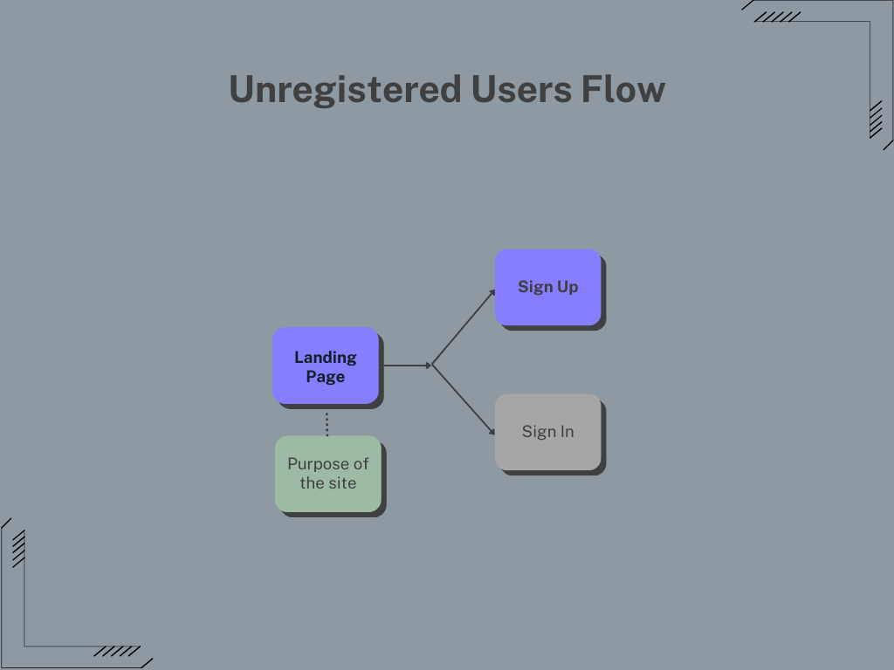

 

[💻Live Site]()

# **Concept**
 
 

# **Index**

- [**Concept**](#concept)
- [**Index**](#index)
- [**SEO**   !!!!!](#seo---)
- [**UX**](#ux)
- [**User Stories**](#user-stories)
  - [**Users**](#users)
  - [**Registered User**](#registered-user)
- [**Features**](#features)
  - [**Features to Implement in Future**](#features-to-implement-in-future)
- [**Flowcharts**](#flowcharts)
  - [**User Unregister 👇**](#user-unregister-)
  - [**User Registered 👇**](#user-registered-)
- [**Database Squema - Elephant SQL**](#database-squema---elephant-sql)
- [**Agile Methodology**](#agile-methodology)
- [**Bugs**](#bugs)
- [**Design**](#design)
- [**Technologies Used**](#technologies-used)
  - [Languages](#languages)
  - [Frameworks and Libraries](#frameworks-and-libraries)
  - [Database Host](#database-host)
  - [Deployment Host](#deployment-host)
  - [Other Resources](#other-resources)
- [**Validation**](#validation)
- [**Testing**](#testing)
- [**Deployment**](#deployment)
- [**Credits**](#credits)
  - [**Content**](#content)

# **SEO**   !!!!!
 
Several SEO techniques were undertaken in order to ensure the site ranks highly in search engine results. Also the files robots.txt and sitemap.xml had been included. The sitemap.xml file had been created using 

[xml-sitemap](https://www.xml-sitemaps.com/)

**Keywords:**
 
Starting with a brain storm of keywords that are relevant to the e-commerce itself. And reduced by making use of a word search so as to target the more relevant, the site I had used is 

[wordtracker](https://www.wordtracker.com/)

**Content marketing:**
 
The information and description of the wares in the site and other sections had been kept the more relevant to the site purpose. Also the keywords had been taken into account when creating things like categories and such, so insure they are present without getting to be considere as spam. 
Each page has its own title, and finally meta tag description had been included in the base so that every page contains them.

# **UX**
In order to follow the tendency we had research in different streaming sites and services, and from this we had decide to follow the dark theme that is commonly used on them.

# **User Stories**
 

## **Users**

 
As User I want to be able to visualize and navigate through the sections of the app
   
   - Navbar 
   - Footer

As Unregistered User I want to see the purpose of the site when landing in it
   - Landing page with clear reference to objective of the app

As User I want to contact the staff if I require help or clarification of a process
   - Contact Form link in Footer

As Unregistered User, I want to be able to register so that I can create my account and access to the registered user features
   - Link for Sign Up in Navbar

## **Registered User**
 

As Registered User I want to access to my account with the saved information on it
   - User Page

As Registered User I want to search for a friend and see the movies they have saved.
   - Users search bar
   - Users Profiles

# **Features**
 
The list and screenshot about them can be found   

[here]()

 

## **Features to Implement in Future**
 
As  the time frame was affected by external factors out of our control, some of the 'could have' features had been left for future implementation.
Howsoever fields and some of the need elements for them had been set in place since the beginning, and are there for when can be done.
Some of them are:

# **Flowcharts**
 
Had been divided in two as for type of users.

## **User Unregister 👇**
 

## **User Registered 👇**
 

# **Database Squema - Elephant SQL**
 
For the data base had been used Mongo, and the diagram is as below.

 

# **Agile Methodology**
 
For keep track of the Agile method I had used Project Board on GitHub.

[Project Board](https://github.com/chingu-voyages/v45-tier3-team-41/projects?query=is%3Aopen).

# **Bugs**
 

The details to the bugs can be found [here]()

# **Design**
 

The wireframes can be found [here](readme_files/docs/wireframes.md)

# **Technologies Used**
 

## Languages

- [HTML](https://html.com/)

- [CSS](https://www.w3.org/Style/CSS/)

- [React]() etc

## Frameworks and Libraries

- [Tailwind](https://tailwindcss.com/)

## Database Host

- [MONGO]()  

## Deployment Host

- 

## Other Resources

- [GitHub](https://github.com/)

# **Validation**
The validation reports can be found ETC

# **Testing**
The testing results can be found [here]()

# **Deployment**
ETC   
The site had been deployed through Heroku. The site had been developed on GitPod, committed and pushed to GitHub. And Heroku once the site is deployed would update automatically. The step for this can be found [here]()

# **Credits**

## **Content**
 
